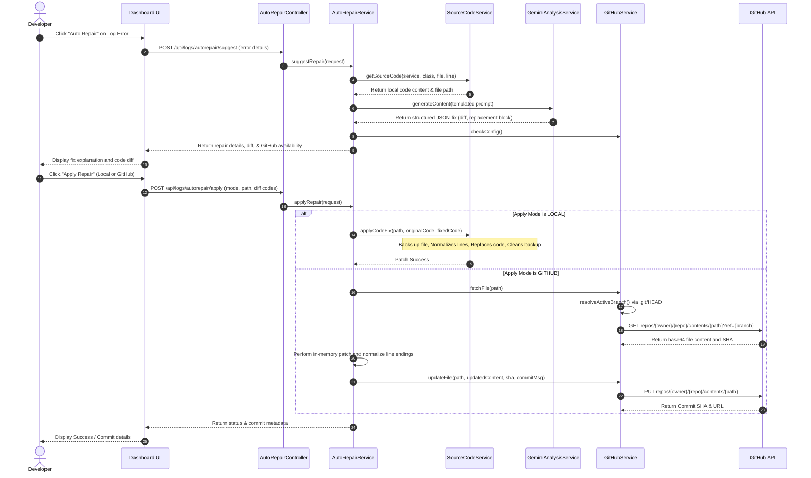

# AI-Powered Automatic Error Repair System

This document outlines the architecture, components, and workflow of the AI-Powered Automatic Error Repair system. This system allows developers to analyze errors from log events, receive context-aware code patches from Gemini AI, and apply those patches directly to their local filesystem or commit them to GitHub.

---

## Architecture Overview

The Auto Repair system spans the Frontend Dashboard and the Backend Log Service.

---

## Component Responsibilities

### 1. REST Endpoint (`AutoRepairController`)
- **Location:** `com.kovanlabs.logservice.controller.AutoRepairController`
- Exposes two primary endpoints:
  - `POST /api/logs/autorepair/suggest`: Requests a repair plan suggestion based on the error's stack trace and class details.
  - `POST /api/logs/autorepair/apply`: Executes a chosen fix plan locally or pushes it to GitHub.

### 2. Coordination Service (`AutoRepairService`)
- **Location:** `com.kovanlabs.logservice.service.AutoRepairService`
- Fetches the local file corresponding to the error, compiles a specialized prompt containing the error log and original source code, coordinates with Gemini to get a structured JSON replacement block, and routes applying patches based on the selected mode (LOCAL vs GITHUB).

### 3. Gemini Integration Service (`GeminiAnalysisService`)
- **Location:** `com.kovanlabs.logservice.service.GeminiAnalysisService`
- Connects to the Gemini AI API using configured API keys to generate structured fixes based on custom instructions.

### 4. Code Resolution & Patching Service (`SourceCodeService`)
- **Location:** `com.kovanlabs.logservice.service.SourceCodeService`
- **Responsibilities:**
  - **Dynamic Project Root Resolution:** Traverses directories starting from `.` to locate the active microservice folder monorepo.
  - **Path Traversal Protection:** Validates that requested files lie strictly inside the resolved project root.
  - **Local Patch Execution:** Performs replacements on disk, including line-ending normalization, temporary backup creation, and automatic rollbacks if a disk write fail occurs.

### 5. GitHub Integration Service (`GitHubService`)
- **Location:** `com.kovanlabs.logservice.service.GitHubService`
- **Responsibilities:**
  - **Dynamic Active Branch Resolution:** Parses the `.git/HEAD` file (e.g. returns `vignesh` or `developed`) so that remote operations match the active branch.
  - **Contents API operations:** Handles base64 conversion and fetches/commits files directly to/from the target repository branch.

---

## Detailed Execution Flows

### A. Suggesting a Repair
1. The developer triggers an auto-repair analysis from an error entry on the observability dashboard.
2. The backend maps the log's microservice name and class to a file on disk.
3. The prompt is assembled by wrapping the original file snippet, target line, and error stack trace in a JSON-specifying system prompt.
4. Gemini returns a structured JSON object containing:
   - `explanation`: Why the bug occurred.
   - `originalCode`: The block to be replaced.
   - `fixedCode`: The corrected replacement block.
   - `diff`: Unified diff formatted for representation.

### B. Applying a Repair (Local Mode)
1. The system creates a backup of the source file (e.g., `Class.java.bak`).
2. It normalizes line endings (`\n` vs `\r\n`) to ensure the search block aligns exactly with the file's structure.
3. The target code is replaced, and the updated content is written to disk.
4. If writing fails, the backup is restored to prevent corruption. Finally, the backup file is deleted.

### C. Applying a Repair (GitHub Mode)
1. The system determines the current active branch name dynamically by reading the local `.git/HEAD` file.
2. It fetches the file and its current blob SHA from the remote GitHub branch.
3. It validates that the `originalCode` block matches the remote code.
4. The file is patched in memory, base64 encoded, and committed back using the GitHub Contents API under the resolved branch.
