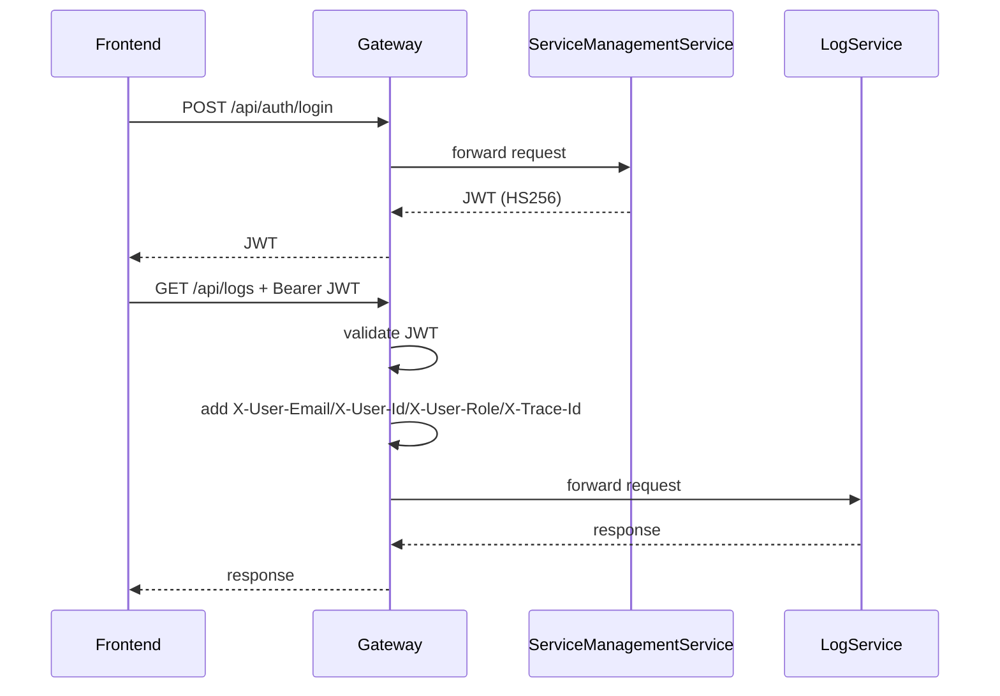
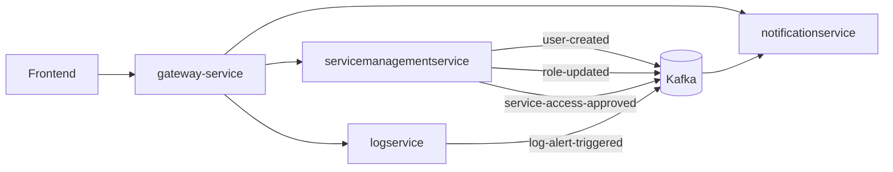

# Production Refactor Blueprint

## 1) Target Bounded Contexts

- gateway-service: edge routing, JWT validation, CORS, rate limiting, request tracing, auth header forwarding.
- servicemanagementservice: identity, Azure OAuth2 login, JWT generation, RBAC, user-service access workflows.
- notificationservice: preference-driven notifications, Kafka consumers, retries, DLQ, delivery tracking, idempotency.
- logservice: log ingestion/querying/analytics, MongoDB storage, Elasticsearch indexing, anomaly detection event emission.

## 2) Strict Ownership Rules

- gateway-service never owns entities, repositories, or persistence.
- servicemanagementservice owns all auth and RBAC tables and APIs.
- notificationservice never contains auth or RBAC rules.
- logservice never contains user/role/permission/notification entities.

## 3) Recommended Package Structure

### gateway-service

- com.kovanlabs.gatewayservice
- com.kovanlabs.gatewayservice.config
- com.kovanlabs.gatewayservice.filter

### servicemanagementservice

- com.kovanlabs.servicemanagementservice.controller
- com.kovanlabs.servicemanagementservice.dto.auth
- com.kovanlabs.servicemanagementservice.dto.rbac
- com.kovanlabs.servicemanagementservice.events
- com.kovanlabs.servicemanagementservice.model
- com.kovanlabs.servicemanagementservice.repository
- com.kovanlabs.servicemanagementservice.security
- com.kovanlabs.servicemanagementservice.service

### notificationservice

- com.kovanlabs.notificationservice.controller
- com.kovanlabs.notificationservice.dto
- com.kovanlabs.notificationservice.model
- com.kovanlabs.notificationservice.repository
- com.kovanlabs.notificationservice.service

### logservice

- com.kovanlabs.logservice.controller
- com.kovanlabs.logservice.model
- com.kovanlabs.logservice.mongo.repository
- com.kovanlabs.logservice.service

## 4) JWT Request Flow

## 5) Service Communication

## 6) Event Contract and Schema Evolution Strategy

Envelope (versioned, backward compatible):

- eventId: unique id for idempotency.
- eventType: business event name.
- schemaVersion: starts with v1.
- occurredAt: UTC timestamp.
- producer: service name.
- payload: additive fields only.

Evolution rules:

- only additive changes for existing versions.
- never reuse or change meaning of existing fields.
- publish new schemaVersion for breaking changes.
- consumers parse known fields and ignore unknowns.

## 7) Retry, DLQ, and Idempotency

- notificationservice consumers use retryable topics (3 attempts).
- failed records routed to DLT via @DltHandler.
- consumed_event table ensures idempotent processing by eventId.
- notification_delivery table tracks status, retries, and errors.

## 8) Database Per Service Policy

- servicemanagementservice -> PostgreSQL + Flyway migrations in its module.
- notificationservice -> PostgreSQL + Flyway migrations in its module.
- logservice -> MongoDB Atlas + Elasticsearch (no JPA/Flyway ownership).
- no cross-service table reads/writes.

## 9) Delete / Refactor Checklist

- [x] remove auth and RBAC leftovers from logservice tests.
- [x] route /api/auth/** and /oauth/** to servicemanagementservice at gateway.
- [x] remove hardcoded DB credentials and secrets from committed YAML.
- [x] remove explicit @EntityScan and @EnableJpaRepositories overlap points.
- [x] standardize event publishing via domain envelope.
- [x] add idempotency and delivery-tracking entities in notificationservice.
- [ ] remove stale compiled artifacts under target/ before CI packaging.
- [ ] add contract tests for event payload compatibility.
- [ ] add integration tests for OAuth2 callback and JWT propagation.

## 10) Migration Roadmap

1. Deploy gateway changes with JWT validation disabled by feature flag in non-prod.
2. Deploy servicemanagementservice auth APIs and OAuth2 callback endpoints.
3. Migrate frontend login to /api/auth/login (and OAuth2 redirect path).
4. Enable gateway JWT validation in staging, then production.
5. Deploy notificationservice retry/DLQ/idempotency changes.
6. Switch logservice anomaly topic to log-alert-triggered.
7. Run smoke tests for request routing and role-protected endpoints.
8. Remove dead monolith classes and stale tests from all modules.
9. Enable CI checks for no cross-module entity/repository imports.

## 11) Runtime Validation Checklist

- login token can be issued from servicemanagementservice.
- gateway denies invalid JWT and forwards valid claims as headers.
- servicemanagementservice emits user-created and service-access-approved events.
- notificationservice consumes events once per eventId and persists delivery state.
- logservice publishes log-alert-triggered events on anomaly.
